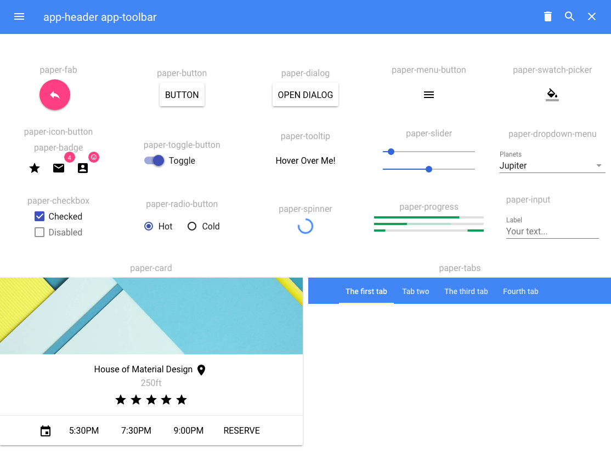

# Paper Kitchen Sink
### A cheat sheet of paper element web components in one page. 

> This is made simply for convenience and does not serve as the documentation for PolymerElements web components. For documentation, please visit: <https://www.webcomponents.org/collection/Polymer/elements>

1) Clone the repository.

```
git clone https://github.com/reyarqueza/paper-kitchen-sink.git
```

2) Install Polymer as a dev dependency.

```
npm install
```

This will install Polymer only in the local node_modules folder in paper-kitchen-sink instead of installing it globally in your Operating System.

3) Install all paper-elements used by the paper-kitchen-sink cheat sheet.

```
bower install
```

All paper-elements installed are from Polymer 2.0 and will be installed in the local bower_components folder of paper-kitchen-sink.

4) Start up the local server.

```
polymer serve
```

As an alternative, if you forget, you can simply start npm as you usually do:

```
npm run dev
```

5) Follow the directions on the terminal. Most likely it will tell you to open your browser at http://127.0.0.1:8081/ or some other local url depending on your environment.

The page will display a collage of paper elements:

